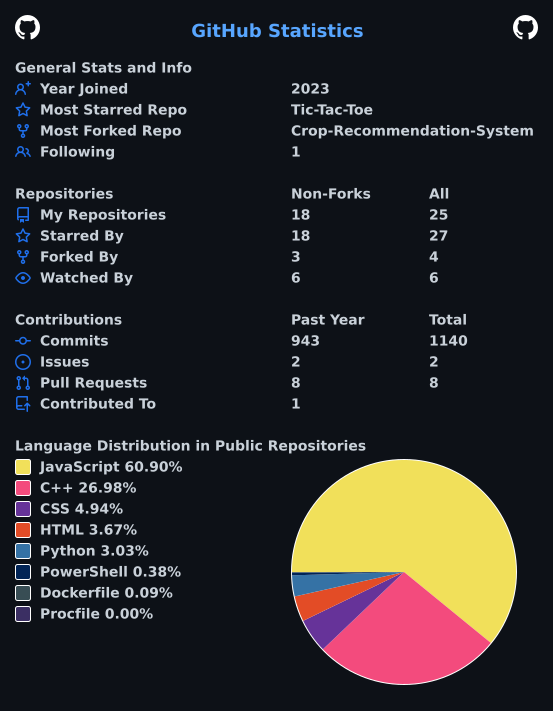

<div align="center">

<div align="center">



</div>
# Anuj Rajput

**Software Developer · Full-Stack · AI/GenAI · Competitive Programming**

[GitHub](https://github.com/rajputanuj303) ·
[LinkedIn](https://linkedin.com/in/anujrajput303) ·
[LeetCode](https://leetcode.com/u/rajputanuj303/) ·
[Codeforces](https://codeforces.com/profile/rajputanuj303)

</div>

---

## About

Computer Engineering student focused on building scalable software,
AI-powered applications, and strengthening problem-solving skills.

- Building full-stack and GenAI applications
- Strong foundation in DSA, DBMS, OS, CN and OOP
- Interested in backend engineering and system design
- 600+ LeetCode problems solved

---

## GitHub

<div align="center">


</div>

<div align="center">


</div>

---

## Contributions

<div align="center">


</div>

---

## Competitive Programming

### LeetCode

<div align="center">


</div>

**600+ problems · 1,690 rating · Top 14% · 32+ contests · 100+ day streak**

### Codeforces

<div align="center">


</div>

---

## Tech Stack

**Languages**

`C++` `Python` `JavaScript` `SQL`

**Frontend**

`React` `Vite` `HTML` `CSS`

**Backend**

`Node.js` `Express.js` `MongoDB` `MySQL` `Redis` `WebSockets`

**AI / ML**

`NLP` `Generative AI` `LLMs` `RAG`

**Core CS**

`DSA` `OOP` `DBMS` `Operating Systems` `Computer Networks`

**System Design**

`HLD` `LLD` `API Design` `Distributed Systems` `Scalability`

**Tools**

`Git` `GitHub` `Postman` `Linux` `VS Code`

---

## Featured Projects

### InterviewIQ.AI

AI-powered mock interview platform that generates resume-based interviews
and provides structured interview reports.

**React · Node.js · MongoDB · Firebase · Razorpay · OpenRouter**

- Resume-based AI interviews
- Interview history and PDF reports
- Authentication and credit-based sessions

[Repository](https://github.com/YOUR_GITHUB_USERNAME/InterviewIQ.AI)

---

### DSA Pair Programmer

Real-time collaborative coding environment with AI-assisted problem solving.

**React · Vite · Node.js · Express · WebSockets · Groq · Monaco**

- Collaborative code editor
- AI pair programmer
- Interactive whiteboard
- Real-time communication

[Repository](https://github.com/YOUR_GITHUB_USERNAME/YOUR_DSA_REPOSITORY)

---

### WebChat

Real-time web chat application built around WebSocket communication.

**Node.js · Express.js · MongoDB · WebSockets**

[Repository](https://github.com/YOUR_GITHUB_USERNAME/YOUR_WEBCHAT_REPOSITORY)

---

## Current Focus

```text
Advanced DSA
Backend Engineering
System Design
Distributed Systems
Generative AI
LLM Applications
Scalable Web Applications
